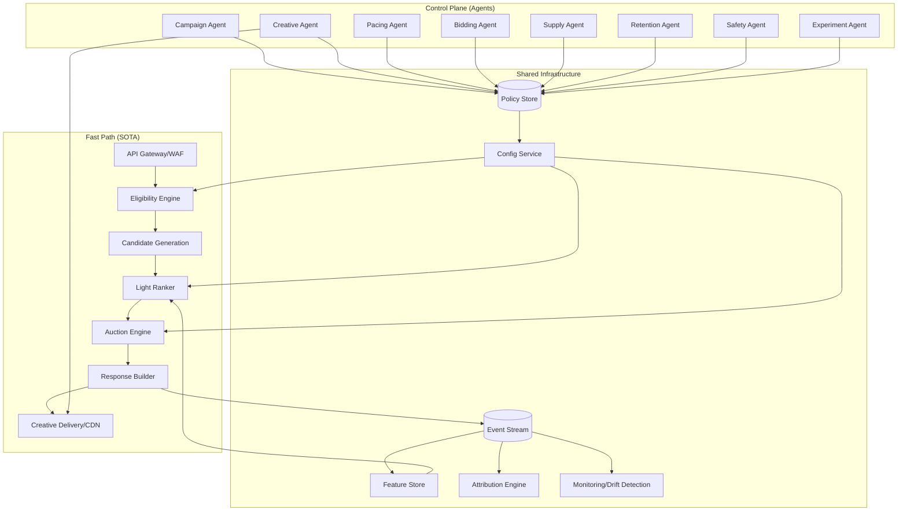
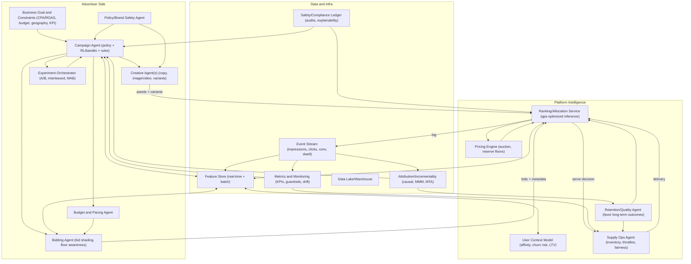
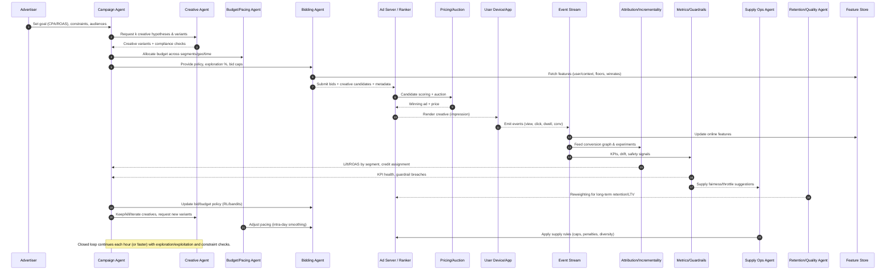

# Technical Specification: Agent-Based Advertising System

> **⚠️ AI-Generated Content Disclaimer**  
> This technical specification was generated with the assistance of artificial intelligence. While the content represents a comprehensive system design based on current industry practices and technical principles, it should be reviewed by qualified engineers and domain experts before implementation. The document serves as a starting point for discussion and should be validated against specific business requirements, technical constraints, and regulatory considerations. Please exercise appropriate due diligence and consult with relevant stakeholders before making any implementation decisions.

---

## Executive Summary

This document outlines the design and implementation of a next-generation advertising system that leverages autonomous agents to optimize campaign performance in real-time. The system maintains state-of-the-art (SOTA) low-latency ad serving while introducing an adaptive, learning-based control plane that continuously improves outcomes through intelligent decision-making.

### Key Innovations
- **Autonomous Agent Ecosystem**: Eight specialized agents working in concert to optimize different aspects of advertising campaigns
- **Real-time Learning**: Continuous adaptation through reinforcement learning and multi-armed bandit algorithms
- **Safety-First Design**: Comprehensive guardrails and compliance mechanisms built into every decision
- **Seamless Integration**: Preserves existing SOTA ad serving infrastructure while adding intelligent control layer

## 1. System Overview

### 1.1 Problem Statement

Current advertising systems suffer from several limitations:
- **Static Optimization**: Fixed rules and manual tuning limit adaptability
- **Reactive Management**: Campaign optimization occurs after performance degradation
- **Disconnected Feedback**: Creative iteration lacks real-time performance feedback
- **Operational Overhead**: Manual intervention required for campaign adjustments

### 1.2 Solution Approach

The Agent-Based Advertising System addresses these challenges through:
- **Autonomous Agents**: Continuous learning and policy adaptation
- **Real-time Optimization**: Proactive campaign and creative management
- **Integrated Feedback Loops**: Seamless connection between performance and optimization
- **Reduced Operational Burden**: Automated decision-making with human oversight

### 1.3 Key Objectives

- Maintain sub-50ms p99 latency for ad serving
- Achieve 15-25% improvement in long-term value metrics (LTV, retention)
- Reduce manual campaign management by 60-80%
- Enable safe experimentation with automated rollback capabilities

## 2. System Architecture

### 2.1 High-Level Architecture

The system consists of three primary layers that work together to deliver intelligent, adaptive advertising optimization:

#### Fast Path (Unchanged SOTA)
The core ad serving infrastructure remains unchanged to maintain proven performance:
- **API Gateway & WAF**: Request validation and security
- **Eligibility Engine**: Audience and inventory filtering
- **Candidate Generation**: Ad selection and ranking
- **Light Ranker**: Distilled ML model for real-time scoring
- **Auction Engine**: Bidding and pricing optimization
- **Response Builder**: Ad creative assembly and delivery

#### Control Plane (Agentic)
Eight specialized autonomous agents that continuously optimize campaign performance:
- **Campaign Agent**: Budget allocation and policy optimization across segments
- **Creative Agent**: Dynamic creative generation and A/B testing
- **Pacing Agent**: Intra-day budget smoothing and exploration control
- **Bidding Agent**: Bid shading and floor adaptation
- **Supply Agent**: Inventory fairness and management
- **Retention Agent**: Long-term outcome optimization
- **Safety Agent**: Brand safety and compliance enforcement
- **Experiment Orchestrator**: Continuous A/B and multi-armed bandit testing

#### Shared Infrastructure
Core services that support both fast path and control plane operations:
- **Policy Store**: Centralized configuration management with versioning
- **Feature Store**: Real-time and batch feature serving
- **Event Stream**: Comprehensive event logging and processing
- **Attribution Engine**: Causal lift and ROAS estimation
- **Monitoring & Observability**: Performance tracking and alerting

### 2.2 Data Flow Architecture

#### 2.2.1 System Component Overview

The following diagram illustrates the high-level system architecture with three main layers and their component interactions:



#### 2.2.2 Detailed System Design

The following diagram provides a comprehensive view of the agent-based advertising system, showing the detailed interactions between advertiser-side agents, platform intelligence components, and data infrastructure. This view emphasizes the data flow and decision-making processes:



**Key Design Principles:**

1. **Separation of Concerns**: Clear boundaries between fast path (real-time serving) and control plane (optimization)
2. **Autonomous Decision Making**: Each agent operates independently while coordinating through shared policies
3. **Continuous Learning**: Real-time feedback loops enable constant improvement and adaptation
4. **Safety by Design**: Compliance and safety mechanisms are integrated at every layer
5. **Scalable Architecture**: Horizontal scaling capabilities for both fast path and control plane components

#### 2.2.3 Agent Interaction Sequence

The following sequence diagram illustrates the real-time interaction flow between agents and system components, showing the complete lifecycle from campaign initialization to continuous optimization:



**Key Interaction Patterns:**

1. **Initialization Phase** (Steps 1-6): Advertiser sets objectives, agents coordinate to prepare campaign parameters
2. **Ad Serving Phase** (Steps 7-9): Real-time ad selection and delivery to users
3. **Feedback Collection** (Steps 10-12): Comprehensive event tracking and feature updates
4. **Analysis & Optimization** (Steps 13-16): Attribution analysis, safety monitoring, and quality assessment
5. **Policy Updates** (Steps 17-20): Continuous optimization through agent decision-making

This closed-loop system enables continuous learning and adaptation while maintaining the low-latency requirements of the fast path. The entire cycle repeats continuously, with agents making incremental improvements based on real-time feedback.

## 3. Agent Specifications

Each agent in the system is designed with specific responsibilities, learning algorithms, and decision-making capabilities. The agents work collaboratively while maintaining autonomy in their respective domains.

### 3.1 Campaign Agent

**Purpose**: Orchestrate overall campaign optimization and coordinate other agents

**Responsibilities**:
- Budget distribution across audience segments and campaigns
- Campaign pacing and timing optimization
- Policy parameter tuning based on performance feedback
- Cross-campaign resource allocation and prioritization
- Coordination with other agents for holistic optimization

**Input Data**:
- Real-time performance metrics (CTR, CVR, ROAS, LTV)
- Budget utilization and pacing data
- Audience segment performance trends
- Historical campaign data and seasonality patterns
- Attribution and incrementality results

**Output Actions**:
- Budget allocation adjustments across segments
- Campaign policy updates and parameter tuning
- Segment prioritization and targeting changes
- Exploration rate modifications for learning
- Coordination signals to other agents

**Learning Algorithm**: Multi-objective reinforcement learning with Thompson sampling for exploration-exploitation balance

### 3.2 Creative Agent

**Purpose**: Optimize creative performance through dynamic generation, testing, and iteration

**Responsibilities**:
- Creative variant generation and selection based on performance data
- A/B test design and execution for creative optimization
- Creative fatigue management and rotation strategies
- Performance-based creative iteration and improvement
- Brand consistency and compliance validation

**Input Data**:
- Creative performance metrics (CTR, engagement, conversion rates)
- User engagement signals and behavioral patterns
- Brand safety requirements and compliance rules
- Creative fatigue indicators and rotation needs
- Historical creative performance data

**Output Actions**:
- New creative variant generation and testing
- Creative allocation adjustments across variants
- Fatigue rule updates and rotation schedules
- Creative kill/keep decisions based on performance
- Creative optimization recommendations

**Learning Algorithm**: Multi-armed bandit with contextual bandits for personalized creative optimization

### 3.3 Pacing Agent

**Purpose**: Ensure smooth budget utilization and optimal exploration-exploitation balance

**Responsibilities**:
- Intra-day budget pacing and spend velocity control
- Exploration vs. exploitation balance optimization
- Budget smoothing across time periods and segments
- Performance-based pacing adjustments and emergency controls
- Seasonal and temporal pattern adaptation

**Input Data**:
- Real-time spend velocity and budget consumption rates
- Budget targets, constraints, and pacing goals
- Performance trends and conversion patterns
- Time-based patterns and seasonality data
- Market conditions and competitive landscape

**Output Actions**:
- Pacing rate adjustments and velocity control
- Exploration rate modifications for learning optimization
- Budget curve smoothing and distribution optimization
- Emergency pacing controls and budget protection
- Temporal optimization recommendations

**Learning Algorithm**: Time-series forecasting with reinforcement learning for adaptive pacing strategies

### 3.4 Bidding Agent

**Purpose**: Optimize bid strategies for maximum value extraction and competitive advantage

**Responsibilities**:
- Bid shading and optimization for cost efficiency
- Floor price adaptation and market dynamics response
- Competitive bid analysis and strategic positioning
- ROI-based bid adjustments and value optimization
- Auction mechanism understanding and exploitation

**Input Data**:
- Auction competition data and bid landscape
- Win rate and clearing price trends
- ROI performance metrics and value attribution
- Market dynamics and competitive intelligence
- Historical auction performance and patterns

**Output Actions**:
- Bid shading function updates and optimization
- Floor price adjustments and market adaptation
- Bid cap modifications and budget allocation
- Competitive response strategies and positioning
- Auction strategy recommendations

**Learning Algorithm**: Auction theory with multi-agent reinforcement learning for competitive bidding optimization

## 4. Policy Management System

The Policy Management System serves as the central coordination mechanism for all agent decisions. It provides a structured, versioned, and auditable way to manage configuration and ensure consistency across the system.

### 4.1 Policy Objects

All system policies are defined as structured objects with versioning, validation, and audit trails:

```json
{
  "policy_id": "campaign_123_pacing_v2",
  "version": "2.1.0",
  "type": "pacing_policy",
  "campaign_id": "campaign_123",
  "parameters": {
    "budget_split": {
      "segment_a": 0.4,
      "segment_b": 0.35,
      "segment_c": 0.25
    },
    "spend_curve": {
      "hourly_targets": [...],
      "daily_targets": [...]
    },
    "exploration_rate": 0.15,
    "safety_bounds": {
      "max_daily_spend": 10000,
      "min_roas": 2.5
    }
  },
  "metadata": {
    "created_by": "pacing_agent",
    "created_at": "2024-01-15T10:30:00Z",
    "approval_status": "approved",
    "rollout_percentage": 100
  }
}
```

### 4.2 Policy Types

#### Eligibility Policy
```json
{
  "audiences": ["retargeting", "lookalike", "prospecting"],
  "frequency_caps": {"daily": 3, "weekly": 15},
  "brand_safety": ["exclude_sensitive_content"],
  "geo_targeting": ["US", "CA"],
  "device_targeting": ["mobile", "desktop"]
}
```

#### Bidding Policy
```json
{
  "base_bid": 2.50,
  "bid_caps": {"max": 10.00, "min": 0.50},
  "shading_function": "thompson_sampling",
  "floor_adaptation": "dynamic"
}
```

#### Creative Policy
```json
{
  "variant_pool": ["creative_1", "creative_2", "creative_3"],
  "allocation": {"creative_1": 0.4, "creative_2": 0.35, "creative_3": 0.25},
  "fatigue_rules": {"max_impressions": 1000, "cooldown_hours": 24},
  "generation_rules": {"style": "brand_consistent", "testing_rate": 0.1}
}
```

## 5. Safety and Compliance Framework

The Safety and Compliance Framework ensures that all agent decisions are safe, compliant, and auditable. This framework is built into every layer of the system to prevent harmful outcomes and maintain regulatory compliance.

### 5.1 Safety Mechanisms

#### Immutable Decision Logging
- All agent decisions logged with full context and reasoning
- Cryptographic signatures for audit trails and non-repudiation
- Immutable storage with configurable retention policies
- Real-time decision monitoring and alerting

#### Canary Rollouts
- Gradual policy deployment with progressive rollout (1%, 5%, 25%, 100%)
- Automated rollback on KPI violations or safety breaches
- Real-time monitoring with configurable alerting thresholds
- A/B testing capabilities for policy validation

#### Guardrails
```json
{
  "spend_bounds": {
    "max_daily_increase": 0.2,
    "max_budget_overspend": 0.05
  },
  "fairness_caps": {
    "min_impression_share": 0.1,
    "max_bid_advantage": 0.3
  },
  "frequency_thresholds": {
    "max_daily_frequency": 5,
    "min_cooldown_hours": 6
  }
}
```

### 5.2 Compliance Features

#### Brand Safety
- Real-time content filtering and classification
- Context-aware placement and environment analysis
- Automated content review and approval workflows
- Brand safety scoring and risk assessment
- Proactive brand protection measures

#### Privacy Compliance
- GDPR/CCPA compliance with automated enforcement
- Limited data retention with automatic cleanup
- Secure identity handling and anonymization
- Consent management and preference tracking
- Privacy-by-design architecture principles

#### Regulatory Adherence
- Industry standard compliance (IAB, MRC, etc.)
- Comprehensive audit trail maintenance
- Transparent reporting and disclosure capabilities
- Regulatory reporting automation and validation
- Compliance monitoring and alerting systems

## 6. Experimentation Strategy

The Experimentation Strategy enables continuous learning and optimization through multiple testing methodologies. This approach ensures that the system can safely explore new strategies while maintaining performance and compliance.

### 6.1 Multi-Armed Bandit Testing

**Creative Optimization**:
- Continuous A/B testing for creative variants with real-time adaptation
- Thompson sampling for optimal exploration-exploitation balance
- Contextual bandits for personalized creative selection based on user context
- Multi-armed bandit optimization for creative performance improvement

**Policy Optimization**:
- Bandit-based policy parameter tuning with safe exploration
- Confidence bounds and statistical significance testing
- Multi-objective optimization for competing goals
- Adaptive exploration rates based on performance feedback

### 6.2 A/B Testing Framework

**Major Policy Changes**:
- Controlled rollout with statistical significance and power analysis
- Geo-based incrementality testing for causal inference
- CUPED variance reduction techniques for improved sensitivity
- Holdout groups and control mechanisms for validation

**Experiment Design**:
- Power analysis for sample size determination and statistical validity
- Stratified sampling for balanced groups and representative testing
- Multiple comparison corrections and false discovery rate control
- Adaptive sample sizing based on effect size and variance

### 6.3 Incrementality Measurement

**Geo-based Testing**:
- Random assignment of geographic regions for unbiased testing
- Causal lift measurement and attribution modeling
- Long-term outcome tracking and LTV measurement
- Cross-geographic validation and consistency checks

**Holdout Groups**:
- Control groups for baseline measurement and comparison
- Incremental ROAS calculation and attribution validation
- Attribution model validation and calibration
- Statistical significance testing and confidence intervals

<!-- 
## 7. Performance and Scaling

### 7.1 Latency Requirements

**Fast Path Performance**:
- p99 latency < 50ms
- p95 latency < 25ms
- p50 latency < 10ms

**Control Plane Performance**:
- Policy updates < 5 minutes
- Agent decision cycles < 1 minute
- Feature store queries < 100ms

### 7.2 Scalability Design

**Horizontal Scaling**:
- Stateless microservices
- Auto-scaling based on load
- Load balancing across regions

**Data Processing**:
- Stream processing for real-time events
- Batch processing for model training
- Distributed feature computation

### 7.3 Reliability Features

**Fault Tolerance**:
- Circuit breakers for external dependencies
- Retry mechanisms with exponential backoff
- Graceful degradation under load

**Monitoring and Alerting**:
- Real-time KPI monitoring
- Automated anomaly detection
- Predictive failure detection

## 8. Implementation Roadmap

### Phase 1: Foundation (Months 1-3)
- Extract current configuration into Policy Store
- Implement Config Service with hot-reload capability
- Set up event streaming infrastructure
- Deploy monitoring and observability

### Phase 2: Shadow Agents (Months 4-6)
- Implement Campaign Agent in shadow mode
- Deploy Pacing Agent with read-only recommendations
- Set up safety and compliance framework
- Establish automated rollback mechanisms

### Phase 3: Guarded Deployment (Months 7-9)
- Enable guarded writes with canary deployments
- Implement Creative Agent with compliance gates
- Deploy Bidding Agent with safety bounds
- Establish comprehensive audit logging

### Phase 4: Advanced Optimization (Months 10-12)
- Implement Retention Agent for long-term outcomes
- Deploy Supply Agent for fairness optimization
- Enable full end-to-end agentic optimization
- Implement advanced experimentation capabilities

### Phase 5: Scale and Optimize (Months 13-15)
- Scale to full production traffic
- Optimize agent performance and efficiency
- Implement advanced ML capabilities
- Establish continuous improvement processes

## 9. Risk Assessment and Mitigation

### 9.1 Technical Risks

**Risk**: Agent decisions lead to performance degradation
**Mitigation**: Comprehensive safety framework with automated rollback

**Risk**: System complexity increases operational overhead
**Mitigation**: Extensive monitoring and automated troubleshooting

**Risk**: Latency impact from additional processing
**Mitigation**: Asynchronous control plane with minimal fast path impact

### 9.2 Business Risks

**Risk**: Advertiser resistance to autonomous optimization
**Mitigation**: Transparent reporting and gradual rollout

**Risk**: Regulatory compliance challenges
**Mitigation**: Built-in compliance framework and audit trails

**Risk**: Competitive advantage disclosure
**Mitigation**: Secure policy management and limited transparency
-->

## 10. Success Metrics

The success of the Agent-Based Advertising System is measured across three key dimensions: performance, business impact, and technical excellence.

### 10.1 Performance Metrics
- **Latency**: Maintain sub-50ms p99 for ad serving
- **Throughput**: Support 100K+ requests per second
- **Availability**: 99.9% uptime SLA
- **Scalability**: Linear scaling with traffic growth

### 10.2 Business Metrics
- **ROAS Improvement**: 15-25% increase in return on ad spend
- **Operational Efficiency**: 60-80% reduction in manual campaign management
- **Creative Performance**: 20-30% improvement in creative effectiveness
- **Long-term Value**: 10-15% improvement in customer LTV

### 10.3 Technical Metrics
- **Agent Decision Quality**: 90%+ accuracy in policy recommendations
- **System Reliability**: <0.1% error rate in agent decisions
- **Experiment Velocity**: 10x increase in testing capacity
- **Learning Efficiency**: 50% faster convergence to optimal policies

## 11. Conclusion

The Agent-Based Advertising System represents a paradigm shift from static, rule-driven optimization to dynamic, learning-based campaign management. By maintaining the proven SOTA ad serving architecture while introducing intelligent agents, the system delivers significant performance improvements while ensuring safety, compliance, and operational efficiency.

### Key Benefits
- **Intelligent Automation**: Reduces manual intervention while improving campaign performance
- **Continuous Learning**: Adapts to changing market conditions and user behavior
- **Safety by Design**: Comprehensive guardrails ensure safe and compliant operation
- **Scalable Architecture**: Supports growth while maintaining performance and reliability

### Next Steps
The phased implementation approach minimizes risk while maximizing value delivery, enabling organizations to gradually transition to agent-based optimization while maintaining full control and visibility throughout the process. Success depends on careful planning, stakeholder alignment, and continuous monitoring of system performance and business outcomes.

---

**Document Version**: 1.0  
**Last Updated**: August 2025  
